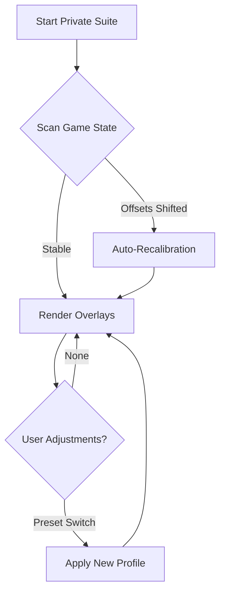

## 🧭 Overview

This private package blends stealthy visualization, predictive targeting, environmental awareness, and system optimization into a configurable toolkit. Designed for players who demand both subtlety and power, every module is customizable—overlays, distance filters, heatmaps, tracking lines, and aim-response curves all shift to match your personal tempo.

No two riders carve the West the same way. This tool honors that.

---


---

## 🎯 Features

Every module is carved for precision, subtlety, and absolute configurability:

* **Spectral ESP Layer**
  Highlights wildlife, enemies, valuables, structures, and vehicles—distance-scaled and color-adjustable.

* **Private Aim Engine**
  A refined soft-lock system with customizable FOV cones, adaptive smoothing, mounted-combat profiles, and prediction curves.

* **Loot & Plant Radar**
  Marks herbs, pelts, ammunition, treasure, and crafting materials for efficient gathering routes.

* **Threat Awareness Heatmap**
  Displays escalating danger zones around towns, camps, and ambush points.

* **Profile QuickSwap Hub**
  *Stealth*, *Hunting*, *Sharpshooter*, *Exploration*—or craft your own profiles from scratch.

[!IMPORTANT]
To maintain a natural feel, avoid pairing aggressive aim curves with high FOV assist—they may overcorrect during rapid movement.

---

## 🖥 Compatibility

| Component         | Support                | Notes                       |
| ----------------- | ---------------------- | --------------------------- |
| **OS**            | Windows 10 / 11        | optimized for DX12 & Vulkan |
| **Game Version**  | RDR2 Singleplayer      | auto-offset patcher         |
| **Hardware**      | Most modern GPUs       | ultra-light rendering paths |
| **Accessibility** | Hue & contrast filters | ideal for night riding      |

---

## ⚡ Setup & Configuration

Let the toolbox settle into your saddlebag:

1. Download the private cheat build via badges above.
2. Extract into a fresh directory (avoid cloud drives).
3. Launch as administrator to initialize memory & overlay modules.
4. Begin with a modest preset:

   ```ini
   [stealth]
   esp_distance = 220
   aim_smoothing = 0.55
   prediction_curve = linear
   herb_radar = true
   heatmap_intensity = 0.35
   ```
5. Open the live tuner (`F7` by default) to refine brightness, target priorities, and FOV boundaries.

[!NOTE]
Players using ultrawide monitors should increase overlay scale by +15% for crisp silhouettes.

---

## 🌿 Mermaid Diagram — Private Engine Workflow

A soft-moving illustration of how the suite processes the frontier’s chaos:



---

## 🔧 Additional Capabilities

* Animal tier indicators for perfect-pelt hunting.
* Horse stamina visualization for long-distance gallops.
* Sniper-line trajectories for long-range sharpshooting.
* Hotkeys:

  * `ALT + R` — toggle world ESP
  * `CTRL + M` — activate mounted-combat mode
  * `SHIFT + C` — cycle custom profiles
* “Dustfall Mode” — minimalist overlays designed for cinematic players.

[!WARNING]
Using high-intensity glow filters during storms or night blends may obscure terrain. Tune brightness conservatively.

---

## ❓ FAQ — Campfire Questions

**Q: Does this affect core missions or cutscenes?**
A: No—only active gameplay modules engage during free-roam and combat.

**Q: Are configs shareable between builds?**
A: Yes, stored as portable `.cfg` files.

**Q: Does it reduce performance?**
A: Very little; heavy wildlife zones may require Lite Mode.

**Q: How frequent are updates?**
A: Minor patches auto-sync; major patches receive tailored updates.

**Q: Can I disable individual modules?**
A: Every feature is independent—enable or disable at will.

---

## 🌙 Final Thoughts

The West rewards those who navigate it wisely. With the **RDR 2 Private Cheats** suite, you gain not dominance but perception: a lantern that brightens the long road, sharpens your shot, and guides your hunts through mist, moonlight, and gunfire. Let it adapt to your rhythm. Let it walk beside you.

---
